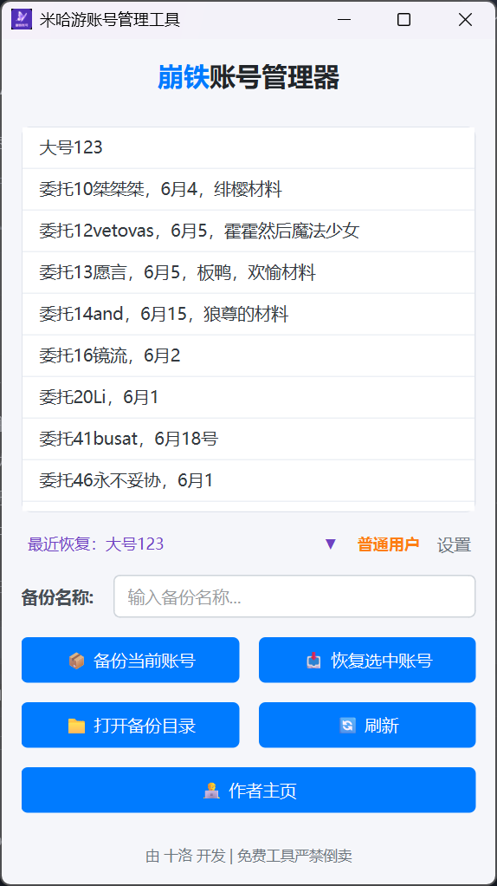
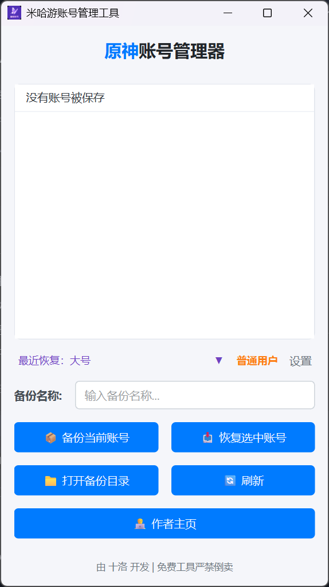
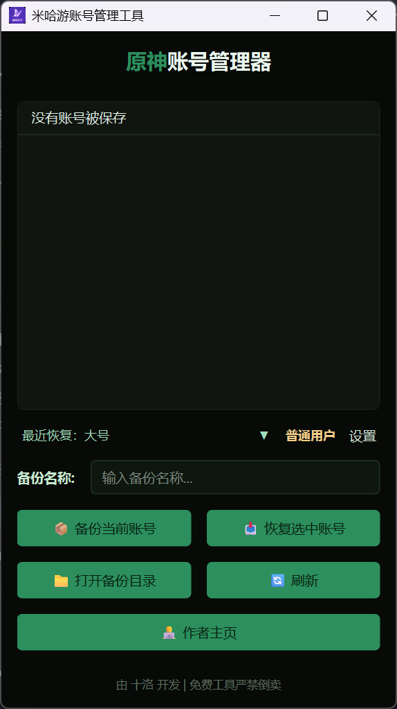
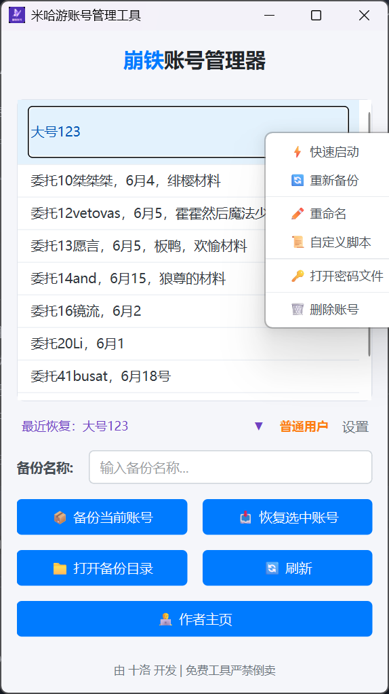

# 米哈游账号管理工具（免费版）

一款米哈游账号管理工具，支持原神、崩坏：星穹铁道、绝区零、崩坏3 国服账号的本地备份与快速切换，免重复扫码登录。

  

---

## 功能介绍

- **账号备份与恢复** — 一键备份/恢复游戏登录凭证，切换账号无需重新扫码
- **快速启动** — 右键「快速启动」，自动恢复账号并启动游戏
- **自动重新备份** — 恢复后自动检测时效，过期自动触发重新备份
- **4 游戏支持** — 原神/崩铁/绝区零/崩坏3 国服，点击标题栏切换
- **主题系统** — 浅色/深色/自定义，支持自定义主色+强调色
- **右键菜单** — 快速启动、重新备份、重命名、自定义脚本等

  
  
  

---

## 下载

| 平台 | 链接 |
|------|------|
| Gitee（国内推荐） | [miHoYoAccountManager](https://gitee.com/Shilore0/miHoYoAccountManager) |
| GitHub | [miHoYoAccountManager](https://github.com/Shilore0/miHoYoAccountManager) |

下载 `miHoYoAccountManager_v3.6_Full.zip`，解压到任意目录，运行 exe 即可。

> 免费版仅提供完整包，除功能异常外不再更新。

---

## 使用说明

1. 启动软件，选择主题
2. 在设置中配置游戏启动器路径（支持自动检测）
3. 登录游戏后，输入名称点击「备份当前账号」
4. 切换账号时，选中账号点击「恢复选中账号」
5. 也可右键选择「快速启动」，一键恢复+启动游戏

---

## 注意事项

- 备份文件包含登录凭证，请妥善保管，不要分享给他人
- 账号有效期约 3 天，建议开启「自动重新备份」

---

> 免费工具，严禁倒卖。

---

## 升级付费版 — LuoKeeper

LuoKeeper 是本工具的付费增强版，在免费版基础上增加了以下功能：

- **国际服支持** — 原神/崩铁/绝区零/崩坏3 国际服账号备份与恢复
- **双快速启动路径** — 两个游戏路径，均支持完整的恢复+启动+自动重备
- **WMI 游戏进程监控** — 检测游戏启动后自动倒计时重新备份
- **崩铁多开解锁** — 国服/国际服，解除单实例限制
- **毛玻璃现代风 UI** — Win11 云母效果、渐变按钮、12 款预设主题
- **中英双语** — 底部按钮一键切换
- **配置自动迁移** — 从旧版 `MHYZH` 自动迁移

| 功能 | 免费版 | LuoKeeper |
|------|:------:|:---------:|
| 国服备份/恢复 | ✅ | ✅ |
| 国际服备份/恢复 | ❌ | ✅ |
| 快速启动 | 单路径 | 双路径 |
| 自动重新备份 | ✅ | WMI 监控 |
| 崩铁多开解锁 | ❌ | ✅ |
| 主题系统 | ✅ | 毛玻璃现代风 |
| 中英双语 | ❌ | ✅ |

### 获取 LuoKeeper

| 平台 | 链接 |
|------|------|
| Gitee（国内推荐） | [LuoKeeper](https://gitee.com/Shilore0/LuoKeerper/) |
| GitHub | [LuoKeeper](https://github.com/Shilore0/LuoKeerper) |
| 联系购买 | QQ：3014205696 / WeChat：shi_luo666 |
